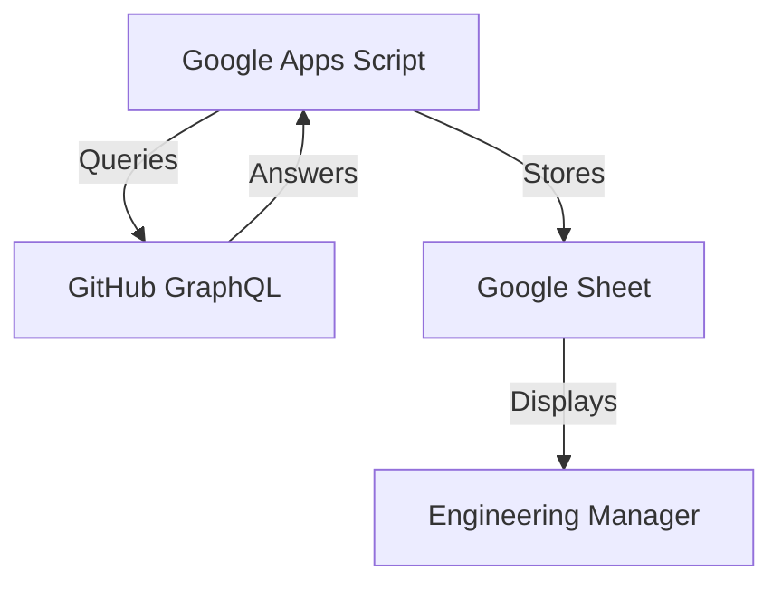
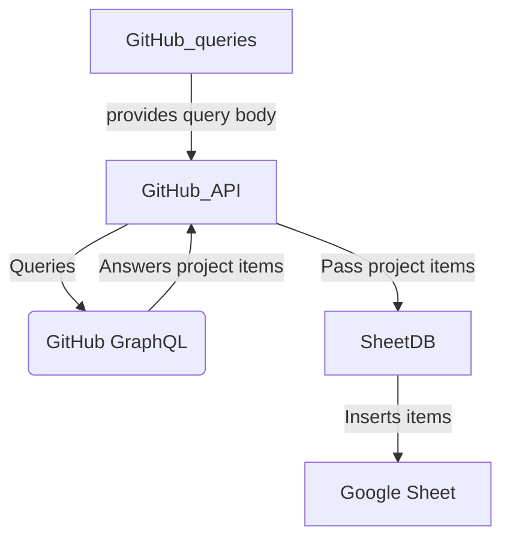
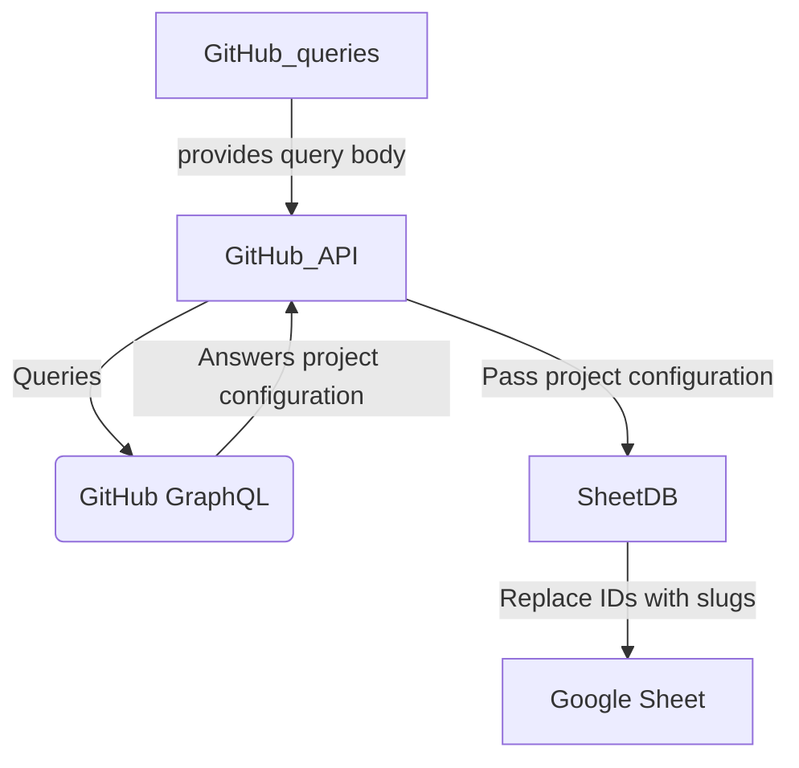

# GH2GS

<i>This is a test project that is not supported and needs specific fine-tuning to be compatible to a given use-case. </i> 

[This GitHub repository](https://github.com/fiedl/github-project-to-csv) offers a script with similar functionalities, go check it out! 

## Context and overview

GitHub projects (and issues) are extensively used by developers. However, GitHub lacks feature dedicated to engineering management and organization such as building metrics from the project data (burndown charts, workload by issue type, etc.)

This project is a first tentative to build a relational database containing items from a GitHub project, so that this data can then be explored and used by engineering managers.

To ease this experimentation, the database is actually a Google Sheet file and the targeted runtime environment is Google Apps Script: Once the data is in Google Sheet, dashboards and metrics can easily be built ; hence this project mostly focuses on the interface with the GitHub GraphQL API.

## Getting started

- Add a file to the project, containing a GitHub token to your account, as follows:

<code>
const GITHUB_TOKEN = 'your_token_to_put_here';

function GetGithubToken(){
    return GITHUB_TOKEN ;
}
</code>

- Replace every occurence of <code>AgentAGadge</code> by your GitHub login in <code>src/api/GitHub_queries.js</code>

Then you should adapt the various mapping done in the code to the structure of your GitHub project and to the database structure you want:
- Change the properties of the <code>ParsedIssue</code> class (<code>src/model/ParsedIssue.js</code>) to match the fields of your GitHub project.

- Change the <code>PROJECT_FIELD_NAME_</code> constants defined in <code>src/model/ProjectConfiguration.js</code> (and everywhere they are used) to match the fields of your GitHub project.

- Change the <code>COLUMN_</code> constants defined in <code>src/model/db/sheetDB.js</code> (and everywhere they are used) to match the columns you want in your Google sheet database.

- Create a sheet names <code>GitHub database</code> in the Google Sheet file you want to use, and make it active.

- Change the projectNumber to identify the project of your user you want to work on in <code>src/main.js</code>

You can then deploy the project into Google Apps Script.
It is recommended to use clasp to deploy code on Google Apps Script. [See here.](https://developers.google.com/apps-script/guides/clasp?hl=fr)

Run <code>CreateGSFromGH</code> from <code>src/main.js</code> in Google Apps Script.

You should see the sheet populated with items from your GitHub project.

## Technical flow

<code>CreateGSFromGH</code> from <code>src/main.js</code> performs the following actions:
- <code>initDB()</code>: Create the sheetDB (write headers in the sheet)
- <code>syncDB()</code>: Retrieve all the needed data from GitHub GraphQL and adapt it for the sheetDB.

syncDB is decomposed the following steps:
- <code>syncGHItemsToDB()</code>: Retrieve all the project items from GitHub, parse them and store them.

Those items have some non human-readable values (IDs instead of names, for GitHub users for instance). It is therefore needed to clean this data so that it can be easily used later on.

- <code>syncGHFieldsToDB()</code>: Retrieve all the project configuration properties and users related to the project, and replaces the non-readable values previously stored by the corresponding slug.

